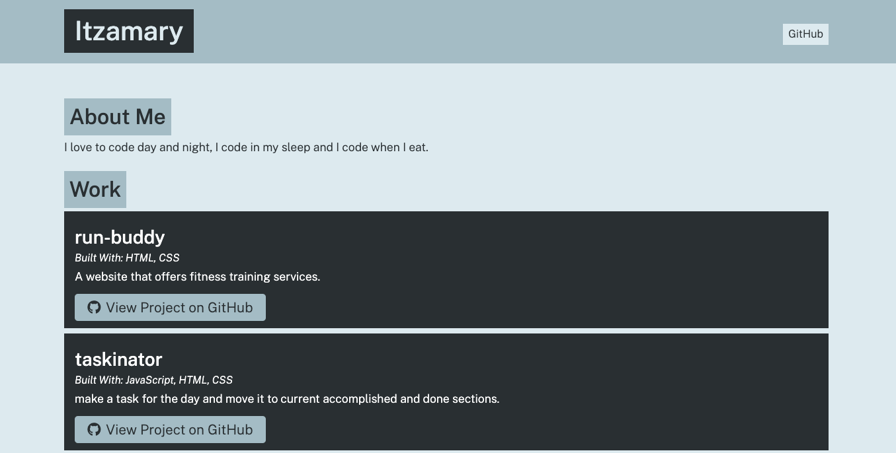

# portfolio-generator

## Description
> In this program a user will dynamically create a portfolio and list projects they has accomplished. We are able to achieve this using node.js and the inquirer npm package. The user will be prompted for information in the termial. After a series of questions and answers, the program will generate a index.html file filled with the information the user typed in the prompts.

## Instructions
1. clone the code and open in vs-code.
2. Open a termianl in root directory, type **npm install** so you can install the dependencies. 
3. In the same termianl type **node app.js** so you can initiate the prompts.

## Technologies / Frameworks
* HTML
* CSS
* javascript
* Node.js
* inquirer npm package

## Image

